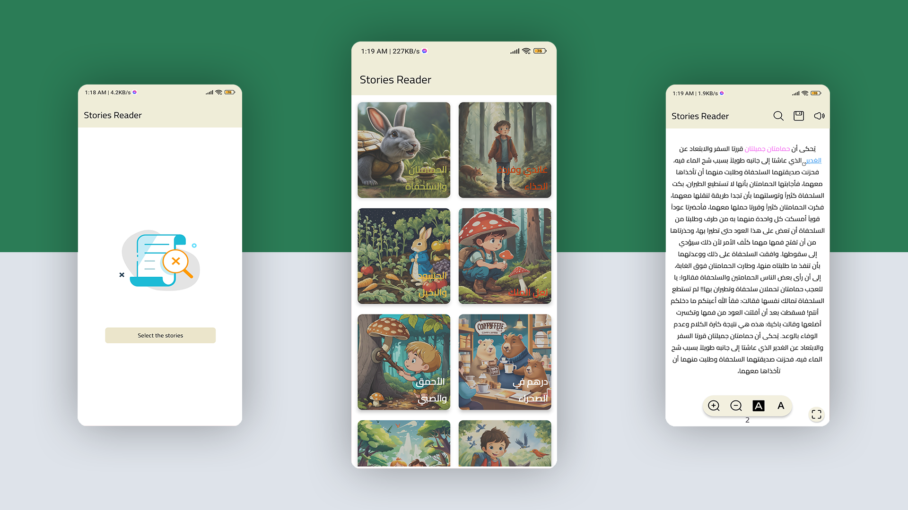
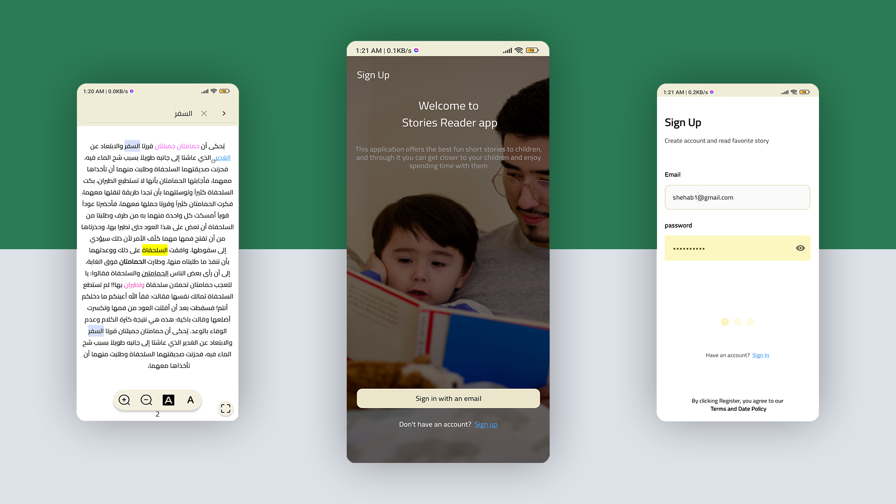

# Story Reading App

## Overview
The Story Reading App allows users to select stories from their phone files and provides a rich reading experience with various customization and interaction features. Users can adjust font sizes, change background and text colors, highlight text, add annotations, and more. The app also includes text-to-speech functionality and a discussion feature for collaborative reading.

## Features
- **Story Selection:**
  - Choose stories from phone files.
  - View a collection of previously chosen stories in an organized and visually appealing manner.

- **Story Viewing:**
  - Display story content with customizable font size.
  - Change background and font colors.
  - Highlight text, make it bold, underline, and change its color.

- **Enhanced Text Interactions:**
  - Add hyperlinks to specific words.
  - Search for specific words or sentences within the story.

- **Speech Feature:**
  - Text-to-Speech functionality to read stories aloud.

- **Discussion and Annotation:**
  - Add comments and notes on specific parts of the text.
  - Annotate text with highlights and marks.

## Usage
1. **Selecting a Story:**
- Use the file browser to select a story from your phone’s storage.
- View the selected stories in your library.

2. **Reading a Story:**
- Tap on a story to start reading.
- Use the customization options to adjust the font size, background color, and font color.
- Highlight text, make it bold, underline it, or change its color as needed.

3. **Enhanced Interactions:**
- Add hyperlinks to specific words by selecting the word and entering the URL.
- Use the search bar to find specific words or sentences within the story.

4. **Using Text-to-Speech:**
- Activate the text-to-speech feature to have the app read the story aloud.
- Control playback with play, pause, and stop buttons.

5. **Annotations and Discussion:**
- Add comments and notes to specific parts of the text.
- Highlight and mark important sections.
